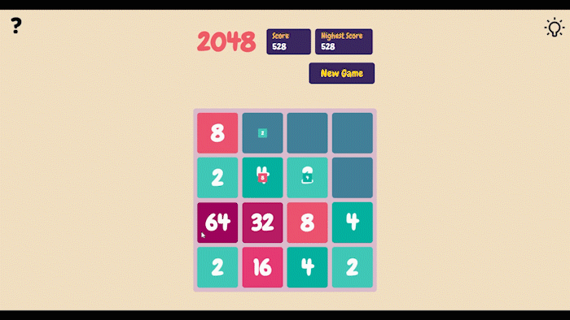
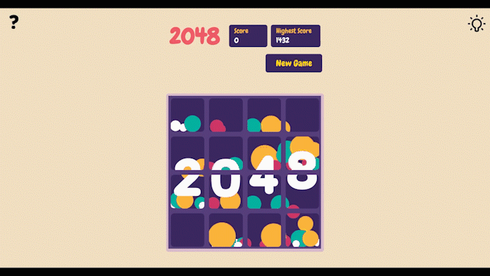
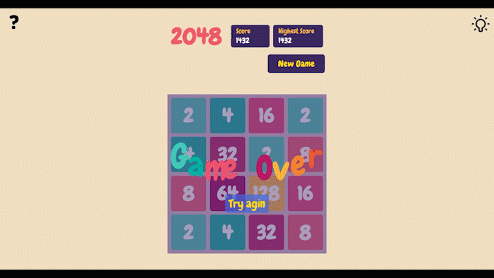
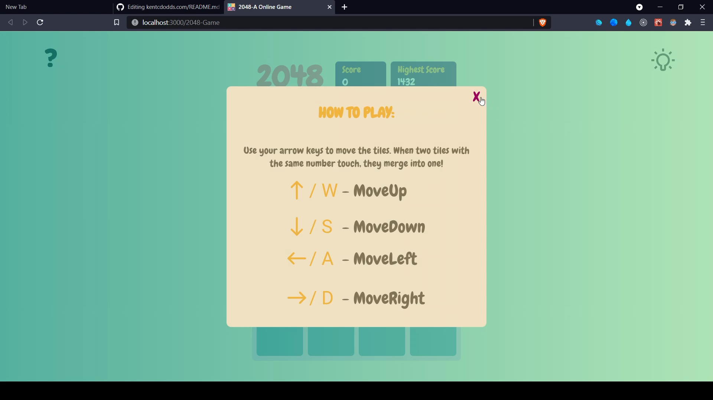
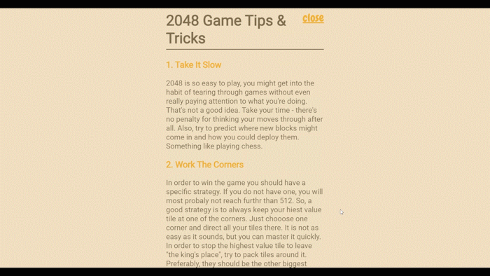

# 2048 - A Online Game


<!-- TABLE OF CONTENTS -->

# Table of Contents

- [Contents](#table-of-contents)
    - [About The Project](#about-the-project)
        - [Game Walkthrough](#game-walkthrough)
        - [Extra Features](#extra-features)
    - [Built With](#built-with)
    - [Contributing](#contributing)
    - [License](#license)
    - [Acknowledgements](#acknowledgements)
        - [Contributes](#contributes)
        - [Resource](#resource)

<!-- ABOUT THE PROJECT -->

## About The Project

A Popular Online 2048-Game. It is a Single-Player Sliding Tile Puzzle Game.

### Game Walkthrough

<table border="0" align="center">
  <tr>
      <p align="center" >
          <a href="https://runtime-terror-team.github.io/2048-Game" target="_blank">
        
        <h4 align="center">Game Page</h4>
        </a>
      </p>
      
  </tr>
  <tr>
    <td>
      <a href="https://runtime-terror-team.github.io/2048-Game" target="_blank">
        
        <h4 align="center">GameCompelete Popup</h4>
      </a>
    </td>
    <td>
    <a href="https://runtime-terror-team.github.io/2048-Game" target="_blank">
        
        <h4 align="center">GameOver Popup</h4>
      </a>
    </td>
  </tr>
  <tr>
    <td width="50%">
      <a href="https://runtime-terror-team.github.io/2048-Game" target="_blank">
        
        <h4 align="center">How to Play Popup</h4>
      </a>
    </td>
    <td>
        <a href="https://runtime-terror-team.github.io/2048-Game" target="_blank">
          
          <h4 align="center">Tips and Tricks Popup</h4>
      </a>
    </td>
  </tr>
</table>

### Extra Features
* Store HighScore in Local Storage
* Addition of Score Animation
* Who first open the game first, HowToPlay Popup showup

## Basic structure of the project repository 📂

```terminal
|- build              # production build
|- public             # Any files within this directory will not be processed by Webpack but copied directly to the build folder.
|- readme             # Contains files helps to create project readme
|- src:               # Contains all source code for the React application.
    |
    |- assets         # Contains media file
        |- image      # all image store here 
    |- components     # Contains all the components used within the app.
    |- helper         # Contains helper functions
    |- hooks          # Contains custom hooks
    |- pages          # Contaion pages used in the projects
    |- styles         # Contains sass or css files.
    |- App.js
    |- index.js
```

## Built With


<!-- CONTRIBUTING -->

## Contributing

[![Contributors][contributors-shield]][contributors-url]

Contributions are what make the open source community such an amazing place to learn, inspire, and create. Any
contributions you make are **greatly appreciated**.

1. Fork the Project
2. Create your Feature Branch (`git checkout -b feature/AmazingFeature`)
3. Commit your Changes (`git commit -m 'Add some AmazingFeature'`)
4. Push to the Branch (`git push origin feature/AmazingFeature`)
5. Open a Pull Request

<!-- LICENSE -->

## License

[![MIT License][license-shield]][license-url]

## Acknowledgements

### Contributes
* [Bivas](https://github.com/Bivas-Biswas)
* [Maseera](https://github.com/MaseeraAhmed)
* [Soumyak](https://github.com/Soumyak10)
* [Narendra](https://github.com/geeknarendra)

### Resource :
- [InspireBy](https://play2048.co/)
- [GameLogic](https://www.youtube.com/watch?v=ca0BEH2bBLs)
- [Choose an Open Source License](https://choosealicense.com)
- [GitHub Pages](https://pages.github.com)
- [GitHub Socialify](https://socialify.git.ci/)
- [Img Shields](https://shields.io)

<!-- MARKDOWN LINKS & IMAGES -->
<!-- https://www.markdownguide.org/basic-syntax/#reference-style-links -->

[contributors-shield]: https://img.shields.io/github/contributors/Runtime-Terror-Team/2048-Game.svg?style=for-the-badge

[contributors-url]: https://github.com/Runtime-Terror-Team/2048-Game/graphs/contributors

[license-shield]: https://img.shields.io/github/license/Runtime-Terror-Team/2048-Game.svg?style=for-the-badge

[license-url]: https://github.com/Runtime-Terror-Team/2048-Game/blob/main/LICENSE
